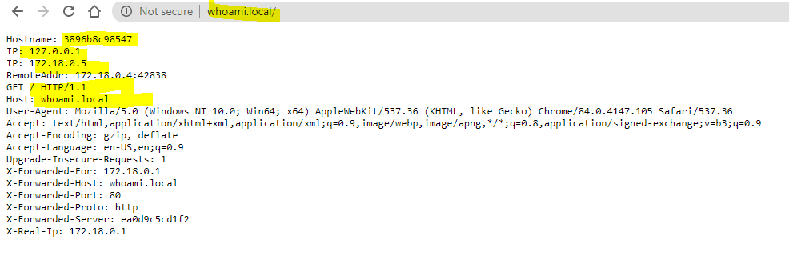

# traefik
## Intro
Traefik is a leading modern reverse proxy and load balancer that makes deploying microservices easy. Traefik integrates with your existing infrastructure components and configures itself automatically and dynamically.

---
This docker image is to spin up docker container image in the local environment. 
> This image is configured with docker to discover the services based on the lable you provided.

Runtime container allows you to accept requests on below ports-
- http -> 80 (web)
- https -> 443 (self signed certs)
- trafik dashboard -> 8080


# Prerequisite
- docker
- docker-compose
- traefik config (included in this repository)
- local DNS config
    - Windowns --> ``` C:\Windows\System32\drivers\etc\hosts```
        -  ``` 127.0.0.1 whoami.local``` -> Whoami image
    - Linux --> ``` /etc/resolve.conf``` 
        - ``` 127.0.0.1   whoami.local```
    The DNS entry is for your service so you can add any number of them and map them to ``` 127.0.0.1```, for example ``` 127.0.0.1   mule.local```

## Quick start

1. Clone this project and change the directory
```sh 
git clone git@github.com:choudharydhaka/traefik.git && \
cd traefik
```
2. Spin the docker container
```sh
docker-compose up -d

```


## Verify

1. Open your browser/postman/any rest client

2. Copy and paste the url ``` http://whoami.local```


### Dashboard
#### Check insites

#### Check routes

## Directory sturcture
```sh
|- docker-compose.yaml
|tls|
|tls|- key.pem # Certificate private key(no passward)
|tls|- cert.pem # Certficate (Public key)
|tls|- tls.yaml # Traefik tls certificate config (feel free to change the certs and use your own)
```

## How to provide lables
Please provide your labels on the service itself. Please check below docker-compose file for the example.
```
    labels:
      - "traefik.http.routers.whoami.rule=Host(`whoami.local`)"     
```
> Above label configure traefik to forward allthe request with DNS name ``` whoami.local``` to this perticular container/service.

> Please add ``` traefik.http.routers.whoami.tls=true``` lable if you want to listen same service on https endpoint as well.

## docker-compose.yaml
```
version: '2'
services:
  whoami:
    # A container that exposes an API to show its IP address
    image: containous/whoami
    labels:
      - "traefik.http.routers.whoami.rule=Host(`whoami.local`)"
      - "traefik.http.routers.whoami.tls=true"

  lb:
    image: traefik:v2.1.4 # The official Traefik docker image
    ports:
      - "80:80"     # The HTTP port
      - "8080:8080" # The Web UI (enabled by --api)
      - "443:443"
    volumes:
      - /var/run/docker.sock:/var/run/docker.sock # So that Traefik can listen to the Docker events
      - ./traefik.toml:/etc/traefik/traefik.toml # trafik config file
      - "./tls/:/opt/certs/"

```

